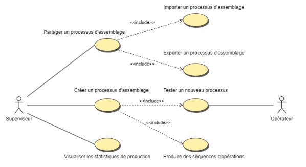
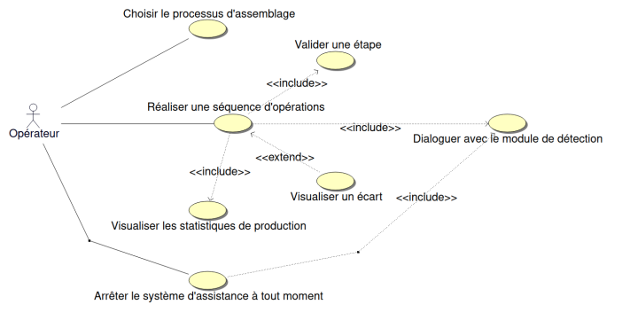
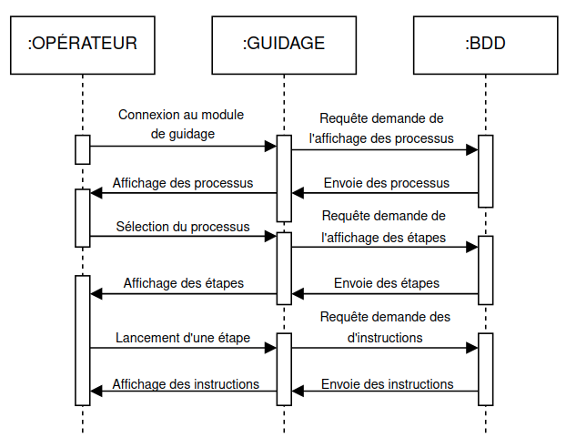

# Ergonomic-Workstation-2025

- [Projet: ergonomic-workstation](#ergonomic-workstation-2025)
  - [Présentation](#présentation)
  - [Recette](#recette)
  - [Utilisation](#utilisation)
  - [Changelog](#changelog)
  - [TODO](#todo)
  - [Diagramme de cas d'utilisation](#diagramme-de-cas-dutilisation)
  - [Équipe de développement](#équipe-de-développement)

---

## Présentation

Il s’agit de digitaliser un poste de travail afin d’accompagner l’opérateur dans la réalisation d’un assemblage.

Le projet est structuré en **deux modules principaux** :  
1. **Module de Création (IR1)** – Déployé sur un **serveur Apache**, il permet aux superviseurs de **concevoir des diaporamas** en organisant des images et du texte dans un ordre spécifique.  
2. **Module de Guidage (IR2)** – Basé sur **Qt (Raspberry Pi)**, il affiche les diaporamas aux opérateurs, leur permettant de **suivre des instructions en temps réel**.  

## Recette

| **Module**            | **Étape**                                      | **A faire**  | **En Cours** | **Terminé** |
|-----------------------|------------------------------------------------|--------------|--------------|-------------|
| **Création (IR1)**    |                                                |              |              |             |
|                       | Créer un processus                             |              |       X      |             |
|                       | Produire des séquences d'opération             |       X      |              |             |
|                       | Partager un processus                          |       X      |              |             |
|                       | Visualiser les statistiques                    |       X      |              |             |
| **Guidage (IR2)**     |                                                |              |              |             |
|                       | Affichage des étapes                           |              |       X      |             |
|                       | Validation des étapes par l'opérateur          |       X      |              |             |
|                       | Enregistrement de la progression               |       X      |              |             |
|                       | Connexion au backend pour récupérer les données|       X      |              |             |
|                       | Interaction avec la base de données            |       X      |              |             |

## Utilisation

## Changelog

## TODO

- ### Module de Création
  - [ ] Mettre en place le serveur Apache et la configuration PHP
  - [ ] Implémenter la création d’un processus
  - [ ] Ajouter la gestion des étapes
  - [ ] Gérer l’upload des images
  - [ ] Afficher les processus créés
  - [ ] Permettre la suppression et modification d’un processus

- ### Module de Guidage
  - [ ] Configurer l’environnement de développement Qt
  - [ ] Créer une interface pour afficher les étapes
  - [ ] Permettre à l'opérateur de valider une étape
  - [ ] Gérer les erreurs
  - [ ] Sauvegarder la progression de l’opérateur

## Diagramme de Cas d'Utilisation
### Module de Création

### Module de Guidage

## Diagramme de Séquence
### Module de Création

### Module de Guidage

## Équipe de développement

- <a href= "https://github.com/clementBernard130">BERNARD Clément</a>
- <a href =https://github.com/ValentinBOUSQUET>BOUSQUET-SOLFRINI Valentin</a>

---
&copy; 2024-2025 LaSalle Avignon
