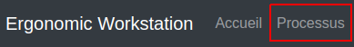
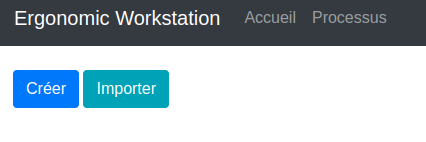
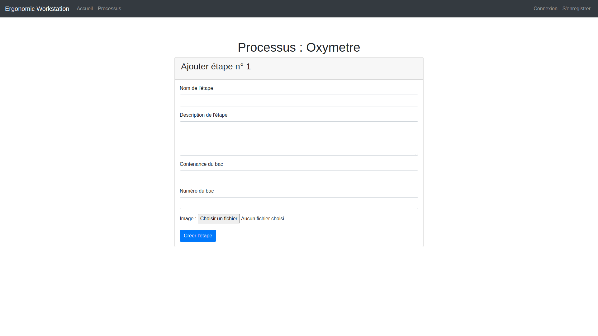
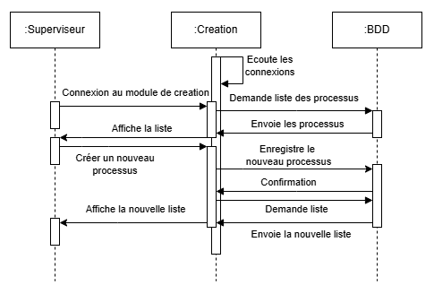
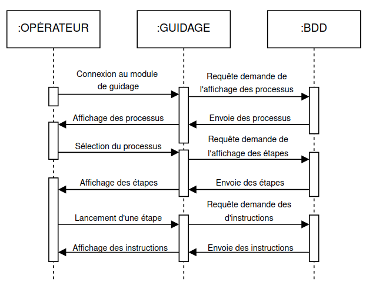

# Ergonomic-Workstation-2025

- [Ergonomic-Workstation-2025](#ergonomic-workstation-2025)
  - [Présentation](#présentation)
  - [Recette](#recette)
  - [Utilisation](#utilisation)
    - [Module de Création](#module-de-création-1)
  - [Changelog](#changelog)
  - [TODO](#todo)
    - [Module de Création](#module-de-création)
    - [Module de Guidage](#module-de-guidage)
  - [Diagrammes de cas d'utilisation](#diagrammes-de-cas-dutilisation)
    - [Module de Création](#module-de-création-2)
    - [Module de Guidage](#module-de-guidage-1)
  - [Diagrammes de séquence](#diagrammes-de-séquence)
    - [Module de Création](#module-de-création-3)
    - [Module de Guidage](#module-de-guidage-2)
  - [Équipe de développement](#équipe-de-développement)

---

## Présentation

Il s’agit de digitaliser un poste de travail afin d’accompagner l’opérateur dans la réalisation d’un assemblage.

Le projet est structuré en **deux modules principaux** :

1. **Module de Création (IR1)** – Déployé sur un **serveur Apache**, il permet aux superviseurs de **concevoir des diaporamas** en organisant des images et du texte dans un ordre spécifique.
2. **Module de Guidage (IR2)** – Basé sur **Qt (Raspberry Pi)**, il affiche les diaporamas aux opérateurs, leur permettant de **suivre des instructions en temps réel**.

## Recette

| **Module**         | **Étape**                                       | **À faire** | **En cours** | **Terminé** |
| ------------------ | ----------------------------------------------- | :-----------: | :------------: | :-----------: |
| **Création (IR1)** |                                                 |             |              |             |
|                    | Créer un processus                              |             |              | X           |
|                    | Produire des séquences d'opération              |             |              | X           |
|                    | Partager un processus                           |             |              | X           |
|                    | Visualiser les statistiques                     | X           |              |             |
|                    | Se connecter en tant que superviseur            | X           |              |             |
| **Guidage (IR2)**  |                                                 |             |              |             |
|                    | Affichage des étapes                            |             | X            |             |
|                    | Validation des étapes par l'opérateur           | X           |              |             |
|                    | Enregistrement de la progression                | X           |              |             |
|                    | Connexion au backend pour récupérer les données | X           |              |             |
|                    | Interaction avec la base de données             | X           |              |             |

## Utilisation  
### Module de Création  

1. **Connexion**  
   Accédez au site web hébergé sur le Raspberry Pi via votre navigateur.

2. **Accès au module**  
   Dans le menu, cliquez sur **Processus** pour accéder au module de création.  
   

3. **Première utilisation**  
   Lors de la toute première connexion, seules deux options sont disponibles :  
   - **Créer** un nouveau processus  
   - **Importer** un processus existant  
   

4. **Si des processus existent déjà**  
   Des options supplémentaires apparaîtront :  
   - **Ajouter des étapes** à un processus existant  
   - **Exporter** un processus  
   

5. **Fonctionnalités à venir (non disponibles pour l’instant)**  
   - **Modifier** un processus  
   - **Voir** les détails d’un processus  
   - **Supprimer** un processus  

## Changelog

## TODO

### Module de Création

  - [X] Mettre en place le serveur Apache et la configuration PHP
  - [X] Implémenter la création d’un processus
  - [X] Ajouter la gestion des étapes
  - [X] Gérer l’upload des images
  - [X] Partager un processus
  - [ ] Afficher les processus créés
  - [ ] Permettre la suppression et modification d’un processus

### Module de Guidage

  - [ ] Configurer l’environnement de développement Qt
  - [ ] Créer une interface pour afficher les étapes
  - [ ] Permettre à l'opérateur de valider une étape
  - [ ] Gérer les erreurs
  - [ ] Sauvegarder la progression de l’opérateur

## Diagrammes de cas d'utilisation

### Module de Création

### Module de Guidage

## Diagrammes de séquence

### Module de Création

### Module de Guidage

## Équipe de développement

- <a href= "https://github.com/clementBernard130">BERNARD Clément</a>
- <a href =https://github.com/ValentinBOUSQUET>BOUSQUET-SOLFRINI Valentin</a>

---
&copy; 2024-2025 LaSalle Avignon
