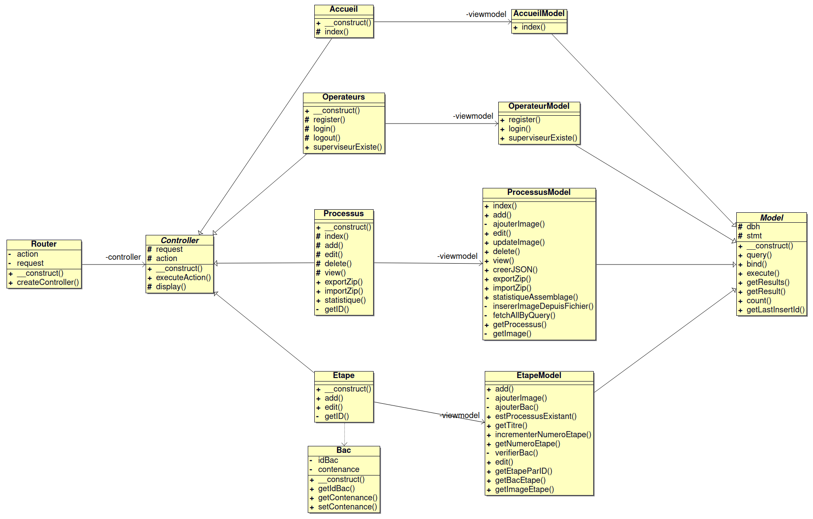

# Projet BTS CIEL 2025 : Ergonomic-Workstation-2025

- [Projet BTS CIEL 2025 : Ergonomic-Workstation-2025](#projet-bts-ciel-2025--ergonomic-workstation-2025)
  - [Présentation](#présentation)
  - [Recette](#recette)
  - [Utilisation](#utilisation)
    - [Module de Création](#module-de-création)
    - [Module de Guidage](#module-de-guidage)
  - [Gestion de projet](#gestion-de-projet)
    - [Changelog : version 1.0](#changelog--version-10)
      - [Module de Création](#module-de-création-1)
      - [Module de Guidage](#module-de-guidage-1)
    - [TODO : version 1.1](#todo--version-11)
      - [Module de Création](#module-de-création-2)
      - [Module de Guidage](#module-de-guidage-2)
  - [Diagrammes des cas d'utilisation](#diagrammes-des-cas-dutilisation)
    - [Module de Création](#module-de-création-3)
    - [Module de Guidage](#module-de-guidage-3)
  - [Diagrammes de séquence](#diagrammes-de-séquence)
      - [Création d’un processus](#création-dun-processus)
      - [Import / Export d’un processus](#import--export-dun-processus)
  - [Diagrammes de classes](#diagrammes-de-classes)
    - [Module de Création](#module-de-création-4)
    - [Module de Guidage](#module-de-guidage-4)
  - [Diagramme de déploiement](#diagramme-de-déploiement)
  - [Équipe de développement](#équipe-de-développement)

---

## Présentation

Il s’agit de digitaliser un poste de travail afin d’accompagner l’opérateur dans la réalisation d’un assemblage.

Le projet est structuré en **deux modules principaux** (IR) :

1. **Module de Création** (déployé sur un **serveur web Apache**) : il permet aux superviseurs de **concevoir des processus d'assemblage** en organisant des images et du texte dans un ordre spécifique (étapes).
2. **Module de Guidage** (basé sur **Qt (Raspberry Pi)**) : il affiche les processus d'assemblage aux opérateurs, leur permettant de **suivre des instructions en temps réel**.

Le poste de travail est aussi équipé d'un module de détection (ER) permettant d’assurer la fonction _pick-to-light_ (indication lumineuse du bac de pièces à utiliser et détection de la prise d’une pièce dans un bac).

## Recette

| **Module**         | **Étape**                                       | **À faire** | **En cours** | **Terminé** |
| ------------------ | ----------------------------------------------- | :---------: | :----------: | :---------: |
| **Création (IR1)** | Créer un processus                              |             |              |      ✅     |
|                    | Produire des séquences d'opération              |             |              |      ✅     |
|                    | Partager un processus                           |             |              |      ✅     |
|                    | Visualiser les statistiques                     |             |              |      ✅     |
|                    | Se connecter en tant que superviseur            |             |              |      ✅     |
|                    | Afficher les processus créés                    |             |              |      ✅     |
|                    | Supprimer et modifier un processus              |             |              |      ✅     |
| **Guidage (IR2)**  | Affichage des étapes                            |             |             |      ✅      |
|                    | Validation des étapes par l'opérateur           |            |              |      ✅      |
|                    | Enregistrement de la progression                |      ⬜     |              |             |
|                    | Connexion au backend pour récupérer les données |            |              |     ✅       |
|                    | Interaction avec la base de données             |            |              |      ✅      |

## Utilisation

### Module de Création

1. **Connexion**
   Accédez au site web hébergé en local via un navigateur web.

2. **Accès au module**
   Dans le menu, cliquez sur **Processus** pour accéder au module de création

3. **Première utilisation**
   Lors de la toute première connexion, seules deux options sont disponibles :
   - **Créer** un nouveau processus
   - **Importer** un processus existant

4. **Si des processus existent déjà**
   Des options supplémentaires apparaîtront :
   - **Ajouter des étapes** à un processus existant
   - **Exporter** un processus

5. **Fonctionnalités désormais disponibles**
   - **Modifier** un processus
   - **Voir** les détails d’un processus
   - **Supprimer** un processus
   - **Statistique** du processus

### Module de Guidage

## Gestion de projet

[GitHub Project](https://github.com/orgs/bts-lasalle-avignon-projets/projects/23)

### Changelog : [version 1.0](https://github.com/bts-lasalle-avignon-projets/ergonomic-workstation-2025/releases/tag/1.0)

#### Module de Création

- Mise en place du serveur Apache et configuration PHP
- Implémentation de la création d’un processus
- Ajout de la gestion des étapes
- Gestion de l’upload des images
- Fonctionnalité de partage de processus
- Affichage des processus créés
- Suppression et modification des processus
- Interface d’import/export via fichiers ZIP (JSON + images séparées)

#### Module de Guidage

- Configurer l’environnement de développement Qt
- Lister les processus d'assemblage
- Sélectionner et démarrer un processus d'assemblage
- Afficher et valider une étape
- Quitter un processus d'assemblage
- Dialoguer avec le poste de travail

### TODO : [version 1.1](https://github.com/bts-lasalle-avignon-projets/ergonomic-workstation-2025/releases/tag/1.1)

#### Module de Création

- [ ] Permettre un tri personnalisé des étapes par drag & drop
- [ ] Ajouter une vue graphique des statistiques d’utilisation des processus
- [ ] Possibilité de prévisualiser le diaporama avant exportation
- [ ] Support multi-utilisateur : journalisation des actions par utilisateur connecté

#### Module de Guidage

- [ ] Gérer les erreurs
- [ ] Sauvegarder la progression de l’opérateur

## Diagrammes des cas d'utilisation

### Module de Création

### Module de Guidage

## Diagrammes de séquence

#### Création d’un processus

#### Import / Export d’un processus

## Diagrammes de classes

### Module de Création

### Module de Guidage

## Diagramme de déploiement

## Équipe de développement

- <a href= "https://github.com/clementBernard130">BERNARD Clément</a> (Module de création)
- <a href =https://github.com/ValentinBOUSQUET>BOUSQUET-SOLFRINI Valentin</a> (Module de guidage)

---
&copy; 2024-2025 LaSalle Avignon
